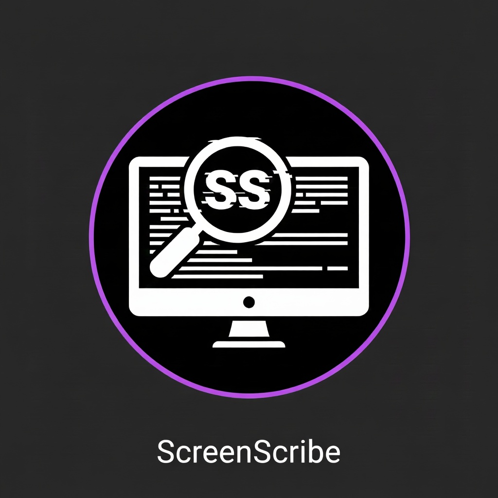

# ScreenScribe

Lightweight Windows tray app to grab a screen region, run OCR (bundled Tesseract), detect barcodes/QR offline (zxing-cpp), and copy the result to the clipboard with a searchable history and configurable global hotkeys.

## Features
- Global hotkeys (defaults): capture `ctrl+shift+s`, history `ctrl+shift+h` (configurable in Settings).
- Barcode/QR detection (offline, zxing-cpp, Apache 2.0). Modes: prefer barcodes with OCR fallback, or OCR-only, switchable in Settings.
- Region selection overlay per monitor; capture to `last_capture.png`.
- Clipboard copy and history list (double-click or `Ctrl+C` to copy); search box; entries numbered newest-first; full text wrapped (no truncation).
- Settings stored locally (`config/settings.json`); single-instance guard; log cleanup after 7 days.
- Bundled Tesseract (`tesseract_bundle`) and resources; no external services.

## Quick Start (dev)
1. Requirements: Python 3.11+, virtualenv.
2. Install deps: `pip install -r requirements.txt` plus `pip install zxing-cpp` (for barcodes).
3. Run from repo root (cwd `src/`): `python -m app.main`.
4. Tray menu:
   - `Capture text now` – draw a rectangle, result to clipboard/history.
   - `History...` – view/search; `Ctrl+C` or double-click copies.
   - `Settings...` – change hotkeys, enable/disable barcode detection, choose mode.
   - `Exit` – quit.

## Hotkeys
- Capture: default `ctrl+shift+s`.
- History: default `ctrl+shift+h`.
- Change via tray → `Settings...`; saved to `config/settings.json`, applied immediately.

## Barcode/OCR pipeline
- If barcodes are enabled and mode is "prefer barcodes": try zxing-cpp first; if any codes are found, text is built as lines `[FORMAT] decoded_text`. If none, fallback to OCR (Tesseract).
- If barcodes are disabled or mode is "ocr_only": skip barcode detection, run OCR directly.
- Supported formats depend on zxing-cpp (e.g., QR_CODE, DATA_MATRIX, EAN_13, EAN_8, CODE_128, etc.).

## Runtime files
- `config/history.json` – latest entries (capped at 50).
- `config/settings.json` – hotkeys and barcode settings.
- `last_capture.png` – last screenshot, overwritten each capture.
- `logs/screenscribe.log` – recreated if older than 7 days.

## Single instance
Uses a shared-memory guard; if already running, shows a warning and exits.

## Build (PyInstaller)
Spec file: `ScreenScribe.spec` (includes resources, Tesseract bundle, hiddenimports for keyboard and zxingcpp).
Steps:
1. `pip install pyinstaller zxing-cpp` (plus other deps).
2. `pyinstaller ScreenScribe.spec`
3. Output: `dist/ScreenScribe/ScreenScribe.exe` plus `resources/` and `tesseract_bundle/`.

## Distributing
- Zip the whole `dist/ScreenScribe` folder and share.
- User unzips and runs `ScreenScribe.exe`; no Python/pip needed.
- First run may prompt for permission to register a global hotkey (keyboard hook).

## Project layout (key paths)
- `src/app/main.py` – entrypoint, single-instance, logging, wiring.
- `src/app/gui/` – tray, overlay, history window, settings dialog.
- `src/app/core/` – capture, OCR/barcodes, history storage, hotkeys, settings.
- `resources/` – icons; `tesseract_bundle/` – Tesseract exe + data.

## Notes
- If a hotkey conflicts, pick another combo in Settings.
- If OCR fails, verify `tesseract_bundle/tesseract.exe` and language files are present next to the EXE.
- Barcode detection is offline; no external API calls. Text from OCR/barcodes is treated as plain text only.
- QR_CODE, DATA_MATRIX, AZTEC, PDF_417, EAN_13, EAN_8, UPC_A, CODE_39, CODE_128, ITF