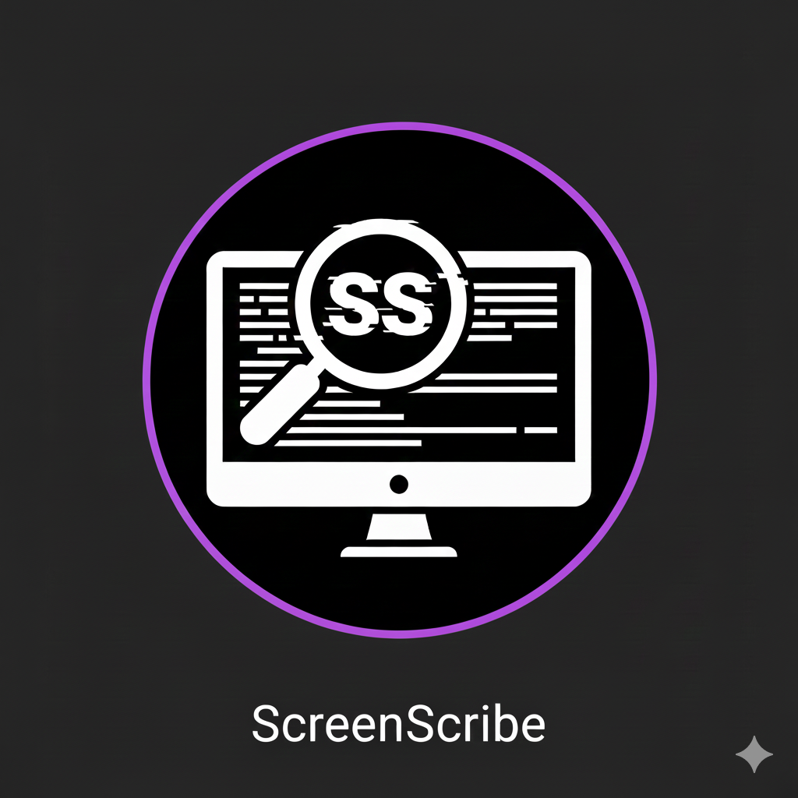

# ScreenScribe

Lekka aplikacja na Windows do wycinania fragmentu ekranu, OCR (Tesseract) i kopiowania tekstu do schowka. Działa z zasobami dołączonymi lokalnie (Tesseract w `tesseract_bundle`), pozwala zmieniać globalny skrót do przechwytywania i trzyma historię wyników.

## Uruchomienie w dev
1. Wymagania: Python 3.11+, środowisko virtualenv.
2. `pip install -r requirements.txt` (pakiety: PySide6, pillow, pytesseract, keyboard).
3. `python -m app.main` z katalogu `src/`.
4. Ikona w zasobniku systemowym → menu:
   - `Capture text now` – zaznacz prostokąt, wynik trafia do schowka i historii.
   - `History...` – lista poprzednich wyników, podwójne kliknięcie kopiuje do schowka.
   - `Settings...` – zmiana globalnego skrótu (domyślnie `ctrl+shift+s`), zapis w `config/settings.json`.
   - `Exit` – wyjście.

## Zmiana skrótu
- Tray → `Settings...` → wpisz np. `ctrl+alt+c` lub `print screen` → `Save`.
- Nowy skrót działa natychmiast i zapisuje się w `config/settings.json`.

## Pliki runtime
- `config/history.json` – historia OCR.
- `config/settings.json` – ustawienia skrótu.
- `last_capture.png` – ostatni zrzut.
- `logs/screenscribe.log` – log aplikacji.

## TO DO 
- Konfiguracja wielkości schowku 
- Zmiana formatu DataTime w History